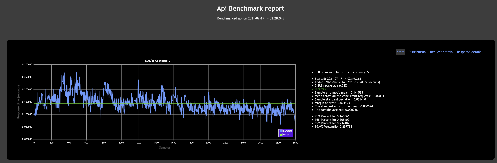
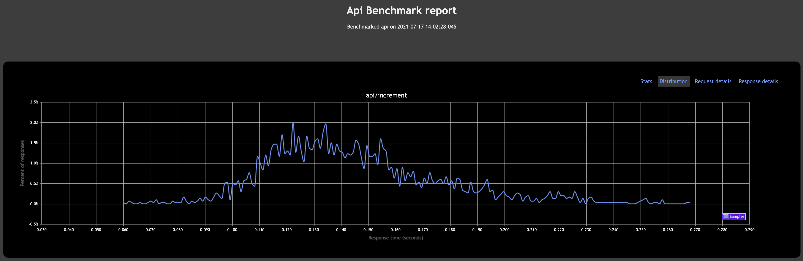
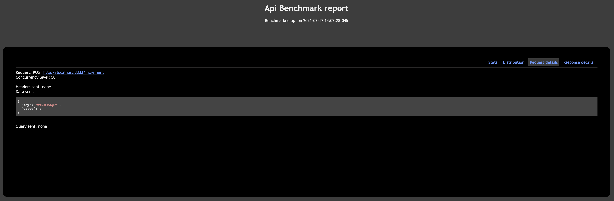
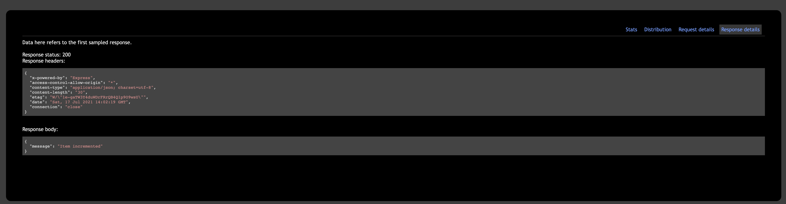
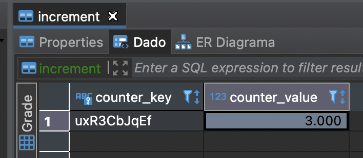

## Postmortem

### Project Name

Modern API

### Date of the project

July 17th, 2021

### Project Goal

The project's goal was to create a service to increase a counter given a key and a value. The API modifies each counter separately in a Key-Value store manner. Moreover, the counters would be stored in a PostgreSQL database, synchronizing the counters on a maximum of ten seconds.

### Project Results

According to the benchmarking, the API handles 4000 to 5000 requests with 20 to 50 simultaneous requests. Each request took 0.002891 seconds locally on average, but this number would definitely incurr an increase when run in a Cloud provider because of the extra latency.

I planned my work with tasks using Github's project; however, I did not estimate them in terms of time. In consequence, it took me more time than I initially planned.

I hadn't used RabbitMQ before, so it took me some extra time to make it work in a docker environment, specially with the predefined settings.

The services are definitely not production ready because of some of the reasons that I describe in the main [README](./README.md). They need more
fine-tuning, especially in terms of security. However, they have the architecture of a scalable service and it would be really easy to continue working on top of that to make it ready for production.

## Benchmarks

I gathered these benchmarks using a single node in the API. As mentioned above, we need an ALB to main API endpoint
scalable. The consumers can be scaled up easier because they don't rely on a specific port.

### Analysis

Initially, the project seemed small and manageable, a simple counter with data storage in PostgreSQL. However, when we think about scalability, it gets more complex. Dealing with concurrency, throughput, and latency for each service was not as easy as it seemed. So, I chose Docker to create each service independently, allowing me to scale it straightforwardly. Although, when I started the benchmarking process, I started facing inconsistent behaviors. For example, the system missed some messages. Due to the time I had, I couldn't thoroughly investigate the causes of this issue.

Interestingly, the messages did not always arrive to the queue, and I hypothesize that since the API opens and closes a RabbitMQ connection every time a request comes in, it faces issues. I didn't have time to investigate RabbitMQ default limits, but this might be a maximum pool connection issue. Since my API is not resilient, if the message failed, there was nothing else to do. For future work, it would be interesting to add an exponential backoff with jitter and queue the requests. Finally, I benchmarked the service with a single node for the API. I'd scale both the API and the consumers horizontally to achieve a better throughput in a production environment. I would also have Dead Letter Queues to re-process messages.

### Action Plan

1. Make sure that we always estimate the project's time

2. Make sure that all of our services can be scaled up. Otherwise, we would have bottlenecks that can limit our throughput.

3. Make sure that we create resilient services with retry mechanisms.

4. Make sure we have an observabiltiy system in place to analyze the benchmark results in an easier manner.
