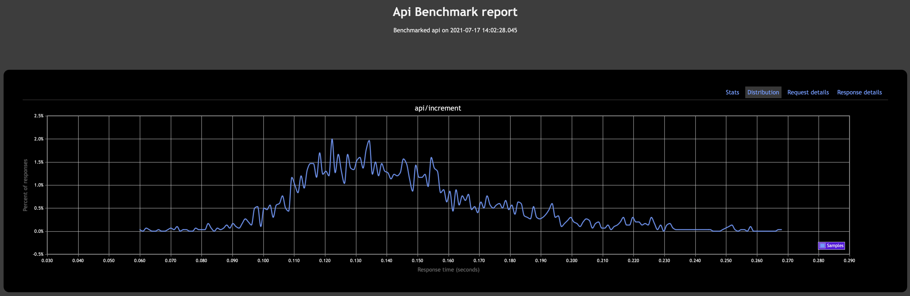
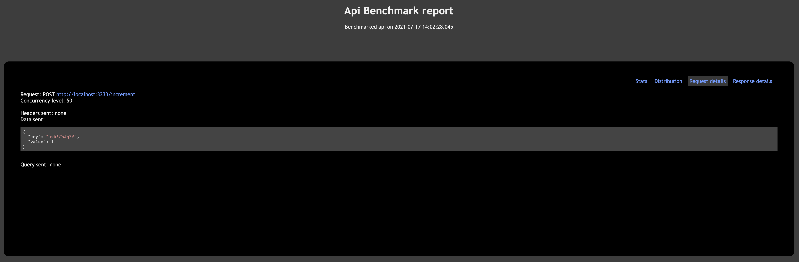
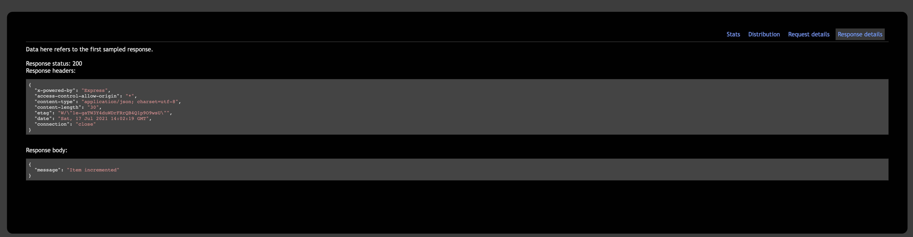
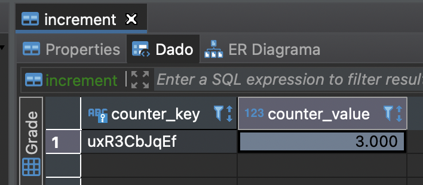

# Modern API

Modern API is an API that increment counters based on a key and a value. Then, these values are inserted into a PostgreSQL
database.

This application is composed of different services

- RabbitMQ service

- PostgreSQL service

- API service

- Consumer service

The first two services are dependencies that must be running. They are single instances without replicas. Ideally,
we would need different replicas that we can spin up if something goes wrong.

[Here](./api) is the API's full description.

[Here](./consumer) is the Queue's consumer full description.

## Prerequisites

- Docker & Docker compose
- Nodejs & npm

## Run the project

```
  docker-compose up -d
```

Or if you have a unix based OS, you can run

```
  make run
```

## Design Decisions

I chose splitting the application into multiple services because it's easier to maintain, reduce code coupling and is
easy to scale. For example, I can scale up the consumers independently from the API. That's really important in large
projects where different teams can work on different services simultaneously.

I chose RabbitMQ because it's a very well established messaging broker. It's very fast and easy to configure.

I chose NodeJS because it's the language that I have most experience with. On top of that, I used Typescript to make
the code more robust. Checkout [an article](https://www.scalablepath.com/blog/start-using-typescript-today/) that I wrote about its benefits.

I chose Docker Compose because it allows to run a set of Docker images in a very straightforward manner. Moreover, Docker
is the default containarization solution by the time I'm writing this project and it's compatible with orchestrators
such as Kubernetes and the majors Cloud providers.


## Caveats and future work

There are many things I'd like to add to this API. Especially, working in non-docker environments since it allows one
to test it faster. However, there are things that I left as future improvements

- Security: Handle secrets and environment variables in a safe manner. Right now, they're hardcoded in the repo.

- Reusability: There are some pieces that I could have reused, such as the RabbitMQ client. For the sake of time, I just
duplicated it at each microservice

- Load Balancing: Adding a load balancer is essential for scalability. Thus, it would be nice to add an ALB in front of
the API.

- Queue finetuning: The queue has a very simple configuration and it's definitely not production ready. However, it
demonstrates the basics of an scalable, event-based application.

- Make the code more resilient: Deal better with the service dependencies. Right now, I have a deterministic and limited
number of retries. Adding an exponential backoff would be helpful too.

- Deal better with exceptions

## Benchmarks

These benchmarks were gathered using a single node in the API. As mentioned above, we need an ALB to main API endpoint
scalable. The consumers can be scaled up easier because they don't rely on a specific port.










## Project Progress

I used a backlog to organize better the project progress. Take a look at it [here](https://github.com/jprivillaso/modern_api/projects/1).

## Contributors

Made with passion by Juan Rivillas